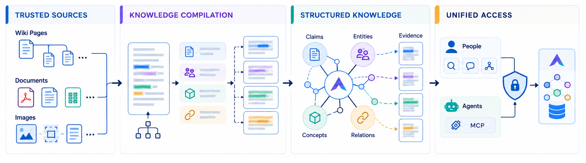
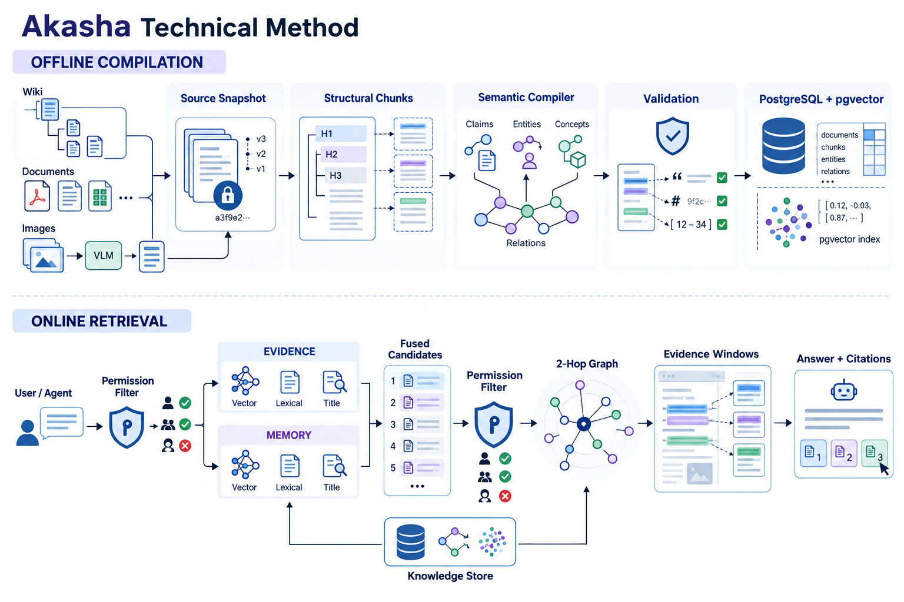

<h1 align="center">Akasha</h1>

<p align="center">
  <strong>面向人类与 AI Agent 的私有化知识工作区，将团队内容转化为有来源依据、遵循权限的组织知识。</strong>
</p>

<div align="center">
  <a href="./README.md">English</a> / 中文
</div>
<br>

<p align="center">
  <a href="./LICENSE"></a>
  
  
</p>

<p align="center">
  
  
  
  
</p>

Akasha 帮助组织把散落在日常工作中的信息和经验，沉淀为可发现、可关联、可复用并且有来源依据的知识。团队可以在共享空间中协作，Agent 则在同一套权限边界内检索和使用组织知识。

它将协作 Wiki、AI 知识编译与检索、关系导航以及基于 MCP 的 Agent 接入整合在一个支持私有化部署的平台中。


## 目录

- [为什么是 Akasha](#为什么是-akasha)
- [功能](#功能)
- [工作原理](#工作原理)
  - [产品方法总览](#产品方法总览)
  - [技术处理流程](#技术处理流程)
- [基准测试结果](#基准测试结果)
- [Roadmap / Vision](#roadmap--vision)
  - [超越页面的组织记忆](#超越页面的组织记忆)
  - [Agent 经验复利](#agent-经验复利)
- [开发](#开发)
  - [安装](#安装)
  - [启动](#启动)
  - [构建](#构建)
- [Agent 集成](#agent-集成)
- [私有化部署](#私有化部署)
- [致谢](#致谢)
- [贡献者](#贡献者)

## 为什么是 Akasha

大多数知识工具只保存页面，大多数 AI 助手则只检索孤立片段。Akasha 将来源内容、派生知识、人类用户和 Agent 连接在同一套权限感知系统中。

- **Wiki 优先的组织记忆** — 团队保留熟悉的协作工作区，同时在内容之上构建可复用的知识层。
- **先有证据，再有答案** — 派生知识和 AI 回答始终与来源页面及支持证据保持关联。
- **超越相似度的结构** — 页面链接、实体、声明、概念和关系提供关键词或向量相似度无法单独覆盖的上下文。
- **人和 Agent 共用同一知识面** — 人类与 MCP 访问遵循相同的工作区和资源权限。
- **基础设施由组织掌控** — Akasha 支持私有化部署，并可配置存储与模型接入地址。

## 功能

| 领域 | 能力 |
| :-- | :-- |
| 协作工作区 | 空间、富文本与 Markdown 页面、附件、评论、版本历史、实时协作和访问控制 |
| 知识编译 | 将页面和空间异步编译为实体、概念、声明、关系、对比、矛盾及支持证据 |
| 检索与问答 | 全文与向量检索、来源引用、支持证据以及权限感知的结果 |
| 关系图谱 | 可视化探索页面直接链接和编译得到的语义关系 |
| Agent 集成 | 通过 MCP 查询知识，并对页面、空间、评论、附件和工作区执行获准操作 |
| 私有化部署 | PostgreSQL 与 pgvector、可配置模型端点，以及本地、S3 或 Azure 文件存储 |

## 工作原理

Akasha 将来源内容与派生知识保留为彼此独立但相互连接的两层。

### 产品方法总览

<p align="center">
  
</p>

### 技术处理流程

<p align="center">
  
</p>

**1. 汇集可信来源。** 团队在共享空间中创建 Wiki 页面或导入内容。原始页面、附件及其权限始终保留为权威来源层。

**2. 编译结构与证据。** Akasha 异步将选定页面和空间编译为实体、概念、声明、关系、对比和矛盾。每项知识产物都保留来源引用和支持证据，并通过索引进入可检索的知识层。知识编译增强原始 Wiki，而不是替代它。

**3. 检索并行动。** 人类通过工作区搜索和问答，Agent 则通过 MCP 访问。全文、向量及关系感知检索共同组织相关上下文，来源权限继续约束结果。回答可以引用支持页面，受支持的 Agent 操作会记录到审计日志中。

## 基准测试结果

Akasha 在三个公开的多跳问答数据集上进行了评测。`R@5` 衡量前五条结果召回的标准证据占比，`F1` 则综合衡量相对于标准证据的检索精确率与召回率。

| 数据集 | R@5 | F1 |
| :-- | --: | --: |
| MuSiQue | **87.17** | 56.57 |
| 2WikiMultiHopQA | 90.50 | 59.66 |
| HotpotQA | **99.00** | 56.19 |
| **平均值** | **92.22** | 57.47 |

在本仓库当前记录的评测配置下，Akasha 在 MuSiQue、2WikiMultiHopQA 和 HotpotQA 上取得了平均 **92.22** 的 Recall@5（`R@5`）与平均 **57.47** 的 `F1`。这些数值描述的是当前记录的检索实验，仅应在数据集和评测设置一致的条件下进行比较。

完整基线对比、各数据集结果及本地评测流程，请参阅 [Akasha Benchmark](benchmark/README.md#多跳问答基准综合对比)。

## Roadmap / Vision

以下内容代表 Akasha 的产品方向，属于探索中的规划，不应视为当前版本已经提供或保证提供的功能清单。

### 超越页面的组织记忆

Akasha 计划从知识工作区进一步发展为更完整的组织记忆系统：

- **事实记忆** — 记录发生了什么，并保留来源产物和出处；
- **交互记忆** — 记录决策、分歧和取舍为什么重要；
- **行动记忆** — 记录接下来应该采取哪些行动、工作流和防护措施。

### Agent 经验复利

未来可能支持将可复用的 Agent Skills、操作模式和执行反馈积累到组织层面，让组织经验能够在不同任务和 Agent 之间持续复用。

## 开发

### 安装

```bash
git clone https://github.com/chaterm/Akasha.git
cd Akasha
pnpm install
```

这是一个 pnpm workspace monorepo。依赖安装和项目脚本都请使用 `pnpm`。

创建本地环境变量文件：

```bash
cp .env.example .env
```

生成本地应用密钥，并将结果写入 `.env` 中的 `APP_SECRET`：

```bash
openssl rand -hex 32
```

不要将 `.env` 或生产环境凭证提交到仓库。

### 启动

使用仓库提供的 Compose 服务启动带 pgvector 的 PostgreSQL，并单独提供 Redis：

```bash
docker compose up -d db
docker run -d --name akasha-redis -p 6379:6379 redis:7
```

然后执行数据库迁移并启动开发服务器：

```bash
pnpm --filter ./apps/server run migration:latest
pnpm run dev
```

打开 [http://localhost:3000](http://localhost:3000)。环境要求、模型配置、服务详情和故障排查请参阅 [`docs/development.md`](./docs/development.md)。

### 构建

```bash
pnpm run build           # 构建所有 workspace 项目
pnpm run client:build    # 仅构建前端
pnpm run server:build    # 仅构建后端
```

构建产物会生成在对应的 `apps/*/dist` 和 `packages/*/dist` 目录中。

## Agent 集成

Akasha 提供 MCP 接口，供 Agent 访问知识工作区。

配置 MCP Server 时需要提供：

- 部署后的 Akasha 实例绝对地址，并在末尾加上 `/mcp`；
- 具有相应工作区权限的 API Key。

MCP 集成支持知识查询，以及对页面、空间、评论、附件和工作区信息执行权限范围内的操作。所有请求都会遵循 Akasha 的授权规则。

安装方式和不同 Agent 宿主的配置示例，请参阅 [`akasha-plugin/README.md`](./akasha-plugin/README.md)。

## 私有化部署

Akasha 面向私有化环境设计。组织可以自行控制应用数据、文件存储和 AI 模型接入地址，并根据自身要求配置访问控制和运行策略。

## 致谢

Akasha 建立在优秀的开源项目之上，在此致谢：

- **[Docmost](https://github.com/docmost/docmost)** — 工作区与编辑器层所基于的协作 Wiki 基础。

## 贡献者

感谢每一位贡献者！
更多信息请参阅[贡献指南](./CONTRIBUTING.md)。
